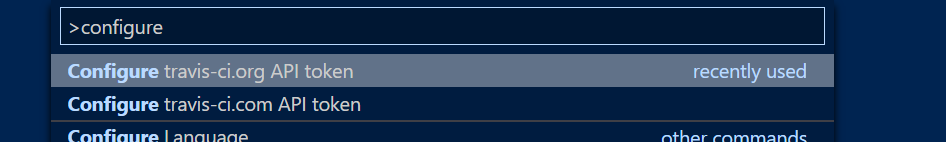
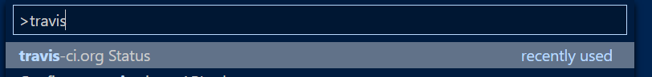
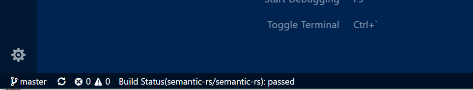

# travis-ci-status

This is a Visual Studio Code extension that allows you to view the Travis CI build status of your project. This extension works with both travis-ci.com and travis-ci.org.

## Features

> Please note that each command is available for travis-ci.org and travis-ci.com. Down below you'll find instructions for travis-ci.org. If your project is built on travis-ci.com, please select the respective travis-ci.com menu point.

First you need to configure your API token (only required once). You can get yours from `https://travis-ci.org/profile/<your username>`. Then, hit `Ctrl+Shift+P` to open the command palette. Type in `Configure travis-ci.org API token` and hit return.

After that it'll try to obtain the status on Travis CI for the current project. If you're switching to another project and you'd like to view the status for it, press `Ctrl+Shift+P` again, type `travis-ci.org Status` and hit return.

Then you'll see a new item on the bottom menu bar, showing you the status of the last build for your project on Travis CI.

## Release Notes

### 1.0.0

Initial Release.
